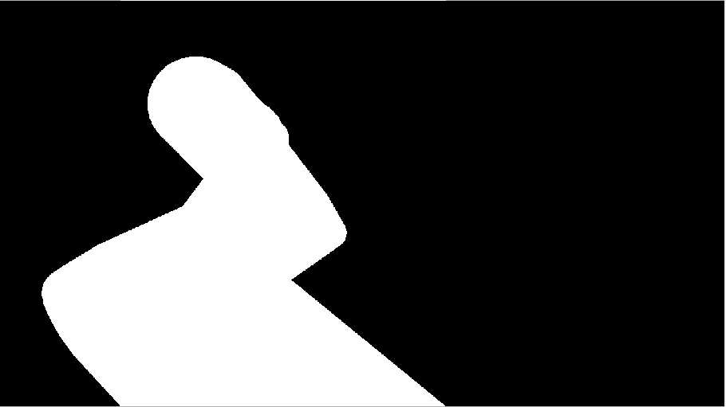

# Virtual Depth Camera 

## Introducation 
The Virtual Depth Camera (VDC) package **generates a virtual depth image** using a simple graphics pipeline in OpenGL, emulating the actual RGBD camera view _(in both intrisincs and extrisincs)_.

The VDC can be used to 
* generate **Occlusion Masks**, informing the vision system which pixels on an RGB or Depth image are occluded by the robot's geometry. 
  * This approach is suitable for top-down application, where objects or locations of interest **are expected to be behind the robot**, not in between the robot and the camera. 
  * Each pixel gets the valie {0, 255} _(= {False, True})_ declaring whther the pixel is occluded by the robot or not.   
* generate a **Virtual Depth Image,** in other words, an image of actual depth values as they would be measured by the RGBD camera.
  * This image can not only inform the vision system on robot occlusions, but also determine whether the robot is between the target of interest and the camera or not.
  * The VD Image can also be used to generate Point Cloud of the robot, and be used for other applications e.g. full body distance calculation   

## Pipeline Summary
The VDC creates a minimal graphics pipeline, where it re-creates the robotic arm in its current configuration using 
the collision STL files from robot_description. The image is rendered at a camera view same as that of the 
actual RGBD camera of the vision system. When superimposing the virtual image and an actual RGB (or D) image, 
the virtual image should properly cover the robot geometry. 





In its initialization, the VDC: 
* Acquires from the camerainfo  topic the camera intrisinc parameters to emulate the actual RGBD camera fov.
* Requests from the `robot_state_publisher` node the `robot_description` parsed XML. **From that it automatically traverses the XML tree** to acquire
  * **All the collision STL mesh files** to be drawn in the image. (all entries that do not contain STLs are ignored)
  * the **<tf_link> names**, in the TF tree 
  * each link's **origin TF** (if missing, it assumes `xyz=[0 0 0 ], rpy=[0 0 0]`)

In its run-loop, the VDC 
* Acquares each `robot_link` TF wrt to the  `camera_frame` TF. Camera frame is broadcased  by the `publishTFs_node` of the calibration package.
* Publishes the mask or virtual depth image at topic `{$camera_prefix_}camera/occlusion_mask` 

## Installation
Install the python dependencies, and you are good to go 
* `pip install -r requirements`

## Dependencies
* PyOpenGL _(installed with pip)_

## How to Run
### Available Launch Files
Various launch file are available for demos and deployment:
* `occlusion_mask.launch.py` is a minimal example on the vdc node and its configuration parameters
* `offline_mask.launch.py` is an offline demo, that can help to verify installation. 
  * **It needs no camera and no calibration**, as it launches its own dummy `camera_frame` and  `DummyCamera` node
  * launch the `arl_description` and the `offline_demo` 
  * You can see in the published images the rendered occlusion mask of the robot in its initialization configuration.
* `online_demo.launch.py` is an online demo. It launches the VDC with the `viz_anabled=True` paramater that publishes a composite image of the mask superimposed to the camera view.  
  * Launch all the necessary nodes (camera_node, description, TF_publisher) as per instructions.
  * Launch some compliant robot controller as well if you want to see the virtual image in motion.  

  


_camera view and virtual mask composite image (available only in `online_demo.launch.py`)_


### Launch Steps

1. launch the vdc node.
    ```
    ros2 launch virtual_depth_camera depth.launch.py
    ```
2. Output message will confirm the `robot_description` and `CameraInfo` are acquired succesfully, and a list of the robot links will be printed. _(In case anything is missing see troubleshooting section)_
   1. If the node proceeds to run succesfully, that means that `camera_frame` is also acquired, and from there on no further messages will be printed. 
  
  ```commandline
  [VIRTUAL_DEPTH_CAMERA] Starting Virtual Depth Camera Node: 
  [VIRTUAL_DEPTH_CAMERA] ---------------INITIALIZATION---------------------
  [VIRTUAL_DEPTH_CAMERA] INIT PROGRESS: 1/2 - Camera Info retrieved from topic
  [VIRTUAL_DEPTH_CAMERA] INIT PROGRESS: 2/2 - Robot Description Received from robot_state_publisher
  [VIRTUAL_DEPTH_CAMERA] ---------------INITIALIZATION---------------------
  [VIRTUAL_DEPTH_CAMERA] 
  [VIRTUAL_DEPTH_CAMERA] -------- Virtual Depth Camera Start --------------
  [VIRTUAL_DEPTH_CAMERA] 
  [VIRTUAL_DEPTH_CAMERA]  The Occlusion Mask will consist of the following links from the URDF file:
  [VIRTUAL_DEPTH_CAMERA]    |   
  [VIRTUAL_DEPTH_CAMERA]    |   right_ur_base_link_inertia
  [VIRTUAL_DEPTH_CAMERA]    |   right_ur_shoulder_link
  [VIRTUAL_DEPTH_CAMERA]    |   right_ur_upper_arm_link
  [VIRTUAL_DEPTH_CAMERA]    |   right_ur_forearm_link
  [VIRTUAL_DEPTH_CAMERA]    |   right_ur_wrist_1_link
  [VIRTUAL_DEPTH_CAMERA]    |   right_ur_wrist_2_link
  [VIRTUAL_DEPTH_CAMERA]    |   right_ur_wrist_3_link
  [VIRTUAL_DEPTH_CAMERA]    |   epick_link
  [VIRTUAL_DEPTH_CAMERA]    |   
  [VIRTUAL_DEPTH_CAMERA]    |_______________________________________
  [VIRTUAL_DEPTH_CAMERA] 
  [VIRTUAL_DEPTH_CAMERA] -------- Virtual Depth Camera Start --------------
  ```


## Parameters and Topics
Here are the configuration ROS2 parameters that can be defined either in a dict() in launch, or in a separate .yaml file.
```python
 parameters=[{
            "mode": "MASK",         # default: MASK.  Choices: "DEPTH", "MASK"
            "viz_enabled": False,    # if True, a composite image of the mask and camera view is pusblished in {$prefix_}camera/composite 
            "camera_prefix": "",    # CAMERA_PREFIX of camera_node topic that VDC emulates
            "camera_frame": "camera_conveyor",  # camera_frame, as it is pubished by the calibration node
            "downscale_factor": 1.0,    # downscales the image, to increase performamce (e.g. 2.0). Any float will do.
            "scaling": 1.0,             # "inflates: the mask to have better coverage of the robot. keep it between [0.98, 1.0]
            "camera_info_topic":"/camera/color/info",
            "camera_color_topic":"/camera/color/image_raw",
            "mask_topic":"/camera/mask",
            "composite_topic": "/camera/composite",
        }]
```
* Generated mask (or virtual depth) is published in same `<$prefix_>_camera/virtual/` topic namespace as original camera.
* Topic `<$prefix_>_camera/virtual/composite` is published **only** when `"viz_enabled": True`


## Implementation Notes and Troubleshooting

### URDF parsing - SOS
**Foremost thing to keep in mind**, is that the VDC accesses the `robot_state_publisher`'s `robot_description` 
parameter, via a built-in ROS2 service. Then it traverses the XML file via the `lxml.etree.path` utility. **This is an easy to break** part of the system, as the paths are fixed, and a different URDF template might bong it up.


 


